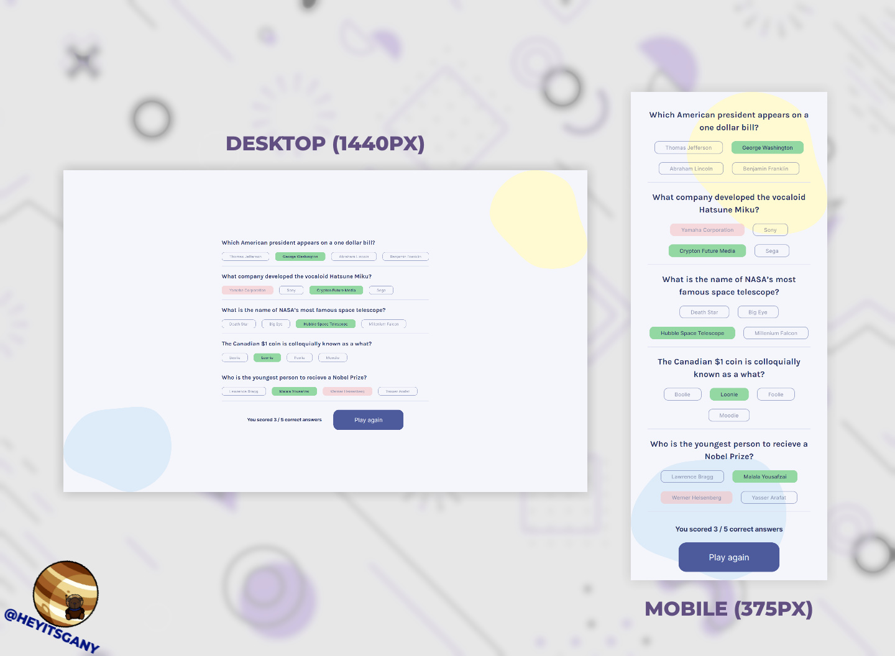

# Quizzical - React Project

This is the final solo project of the [Learn React](https://scrimba.com/learn/learnreact) course on Scrimba. The design of the page was provided, however all code has been built from scratch. This project makes use of React components, and React hooks (useState and useEffect). It also makes use of two external react libraries, Nano ID and HTML Entities.

## About The Project



The project aims to create a quiz game that pulls directly from the Open Trivia Database API and gives the user five random questions to answer, then allows you to check your score.

Live site: [https://heyitsgany.github.io/quizzical/](https://heyitsgany.github.io/quizzical/)

## Built with

- [React.js](https://reactjs.org/)
- Semantic HTML5 markup
- CSS custom properties
- Flexbox

## My Approach

The page makes use of only 34different components. The main "App" component, a "Splash" screen component, a "Quiz" screen component, and a reusable "Question" component.

The "App" component conditionally renders either the "Splash" screen or the "Quiz" component based on a state that is toggled by a 'Start Quiz' button on the "Splash" screen. This allows me to keep this as a single page React app.

The "Quiz" component handles all the logic of the main quiz. Firstly, I have a useEffect that makes an async request to the opentdb.com API, and then stores the returned object in a React useState (allQuestions).

I have another useEffect that has a dependency on the allQuestions state, this randomizes the answers for each question and stores them in another React use state (allAnswers).

I then map over the allQuestions state to create a question and answer element for each question using the reusable "Question" component. This "Question" component renders the question and the relevant answers as radio inputs and labels.

There are also a couple of other states used to store the final score, and to act as toggles for the results screen and to reset the game to play again.

Once the check answers button is clicked I conditionally disable all the radio inputs (so answers cannot be changed). I also conditionally add a class name to the relevant answer to allow my CSS to style it green. I also use CSS to style an incorrectly selected answer red.

## Interesting Challenges

### Creating a reusble 'question' component

As I wanted to make use of a reusable component to handle each question, I would pass the relevant information to the component with props. The component would then handle randomizing the answers and creating the answer inputs. I would also pass a handleChange function and formData state to the component to allow for controlled inputs.

However, I realised that whenever a controlled input updated the parent state the element would re-render and the answers would randomize again. This created an unusual effect where the answers would scramble every time you picked an answer.

I solved this fairly easily by moving the answer randomization function to the parent, "Quiz" component. All of the answers are now randomized once the questions have been pulled from the API.

### API returning encoded results

When requesting questions from the Open Trivia Database, the API will return results in an encoded format. The default format is using HTML codes. For example the sentence: "Don't forget that π = 3.14 & doesn't equal 3." would be returned as:

```
Don&‌#039;t forget that &‌pi; = 3.14 &‌amp; doesn&‌#039;t equal 3.
```

I made use of the HTML Entities library on the npm to solve this issue. It has a decode function that will decode HTML codes and replace them with characters.

### React unique key error

To avoid a common error in React when creating a list of elements I made use of another external library on the npm called Nano ID. Every time I need to create a unique key for an element I would use nanoid() to create a unique string ID.

## Roadmap

This project is complete as far as the design file from the original Scrimba course. However I may in future add some extra functionality as continued practice of my React knowledge.

- Add a total score to track multiple games, possibly using local storage.
- Add an option to choose the category of the questions.
- Add an option to choose the difficulty of the questions.

## Acknowledgments

- [Nano ID](https://www.npmjs.com/package/nanoid)
- [HTML Entities library](https://www.npmjs.com/package/html-entities)
- [GitHub Pages](https://pages.github.com/)
